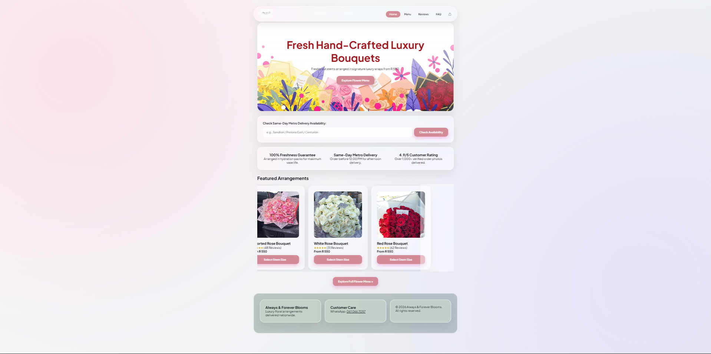
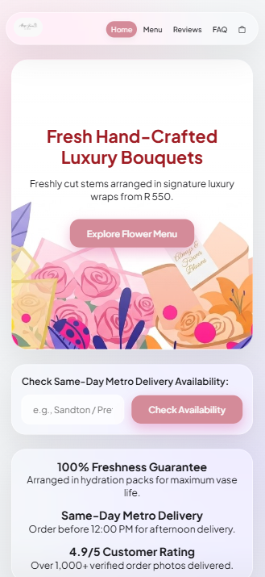
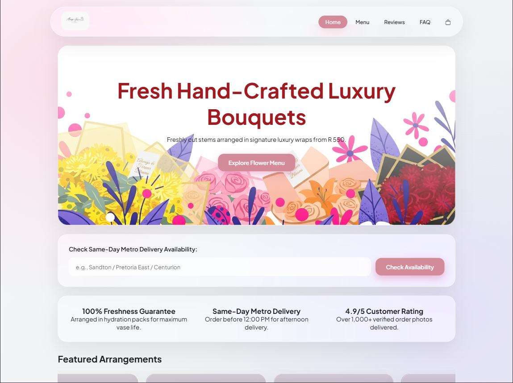
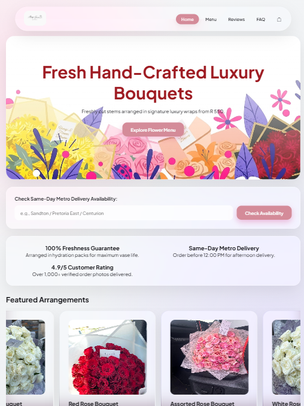
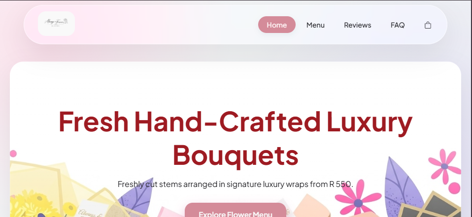

# Web-Dev-POE.2
A continuation of the website from part 1, inserting CSS

Project: Web Dev for Always and Forever Blooms Website ST10511987, Neo Charles Mathipa, DISD1 Group 6

github account(my repository link is right in the profile)

[text](https://github.com/CharlesMathipa)
=================================================================================================

*Website Goals and Objectives: We strive to reach more customers through this website since not everybody uses Instagram and as we all know everybody has got a google on their devices and by the use of the website we can all people to pay directly through it which secures payments by reducing the risk factors of paying into the wrong bank account.

=================================================================================================

*key features Bouquet Catalogue/menu which allows users to view our products on a scalable plane Online Payment Feature allows users to pay directly on the website FAQ page which answers frequently asked questions which helps and supports our customers

=================================================================================================

Timeline and Milestones Week 1: 4-6 Aug, I had to conduct research and gather resources on building the website Week 2: 10-14 Aug, I created the base of the Website by only using HTML Week 3: I will add details and decorate the website with CSS Week 4: Add functionality and fix any logic that i come across

=================================================================================================

*Changes made
+restructured all the HTML documents
+added CSS for styling
+Added the shopping cart icon from BOOTSTRAP
+Whole Webpage styling is inspired by Apple's liquid glass and a rose with the footer with a sage green color representing a rose stem then the upper part of the body having a pink/red hue representing the rose petals.

=================================================================================================
CiteMap

Always & Forever Blooms
├── index.html (Home)
├── menu.html (Flower Menu)
│   └── product.html (Product Details)
├── reviews.html (Customer Reviews)
├── faq.html (FAQ & Care Guide)
├── cart.html (Cart & Checkout)
└── contact.html (Contact Us)
=================================================================================================

*Visualization of the website on different devices
+on a full screened PC
 

+on a mobile device like an iphone 16 pro max(portrait)

+on a IPad Pro/Tablet(landscape)

+on a IPad Pro/Tablet(Portrait)

+on a mobile device like an iphone 16 pro max(landscape)

=================================================================================================

*References
CSS-Tricks, 2026. CSS-Tricks. [online] Available at: https://css-tricks.com [Accessed September 2026].

Fireship, 2026. Fireship. [online video] Available at: https://www.youtube.com/@Fireship [Accessed September 2026].

Google, 2026a. Google Search: how to add liquid glass to a website with only css. [online] Available at: https://www.google.com/search?q=how+to+add+liquid+glass+to+a+website+with+only+css [Accessed September 2026].

Google, 2026b. web.dev. [online] Available at: https://web.dev [Accessed September 2026].

MDN Web Docs, 2026. MDN Web Docs. [online] Available at: https://developer.mozilla.org [Accessed September 2026].

Powell, K., 2026. Kevin Powell. [online video] Available at: https://www.youtube.com/@KevinPowell [Accessed September 2026].

Tech2 etc, 2021. Build and Deploy Ecommerce Website With HTML CSS JavaScript | Full Responsive Ecommerce Course FREE. [online video] Available at: https://www.youtube.com/watch?v=P8YuWEkTeuE [Accessed September 2026].

Traversy Media, 2026. Traversy Media. [online video] Available at: https://www.youtube.com/@TraversyMedia [Accessed September 2026].

W3Schools, 2026. W3Schools Online Web Tutorials. [online] Available at: https://www.w3schools.com [Accessed September 2026].

Web Dev Simplified, 2026. Web Dev Simplified. [online video] Available at: https://www.youtube.com/@WebDevSimplified [Accessed September 2026].

Wooldridge, G., 2025. Recreate the iOS 26 Liquid Glass effect with HTML/CSS only. [online video] Available at: https://www.youtube.com/shorts/BDpR3loGIFQ [Accessed September 2026].

=================================================================================================

